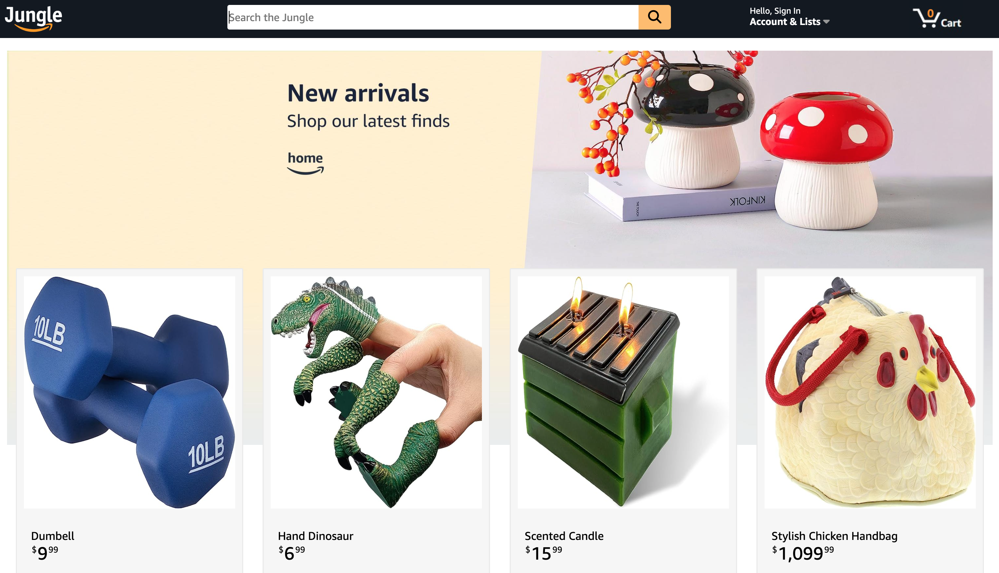
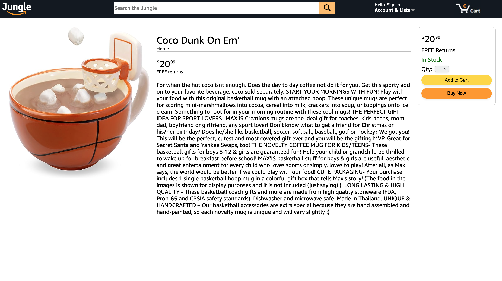
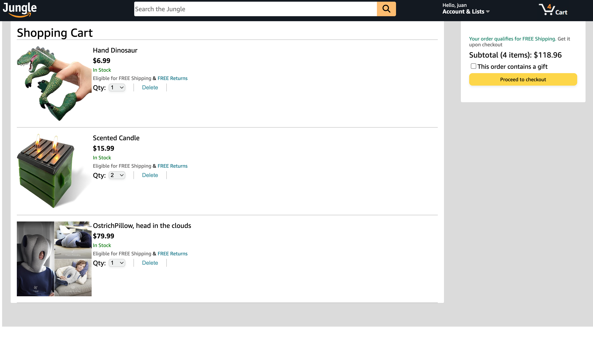
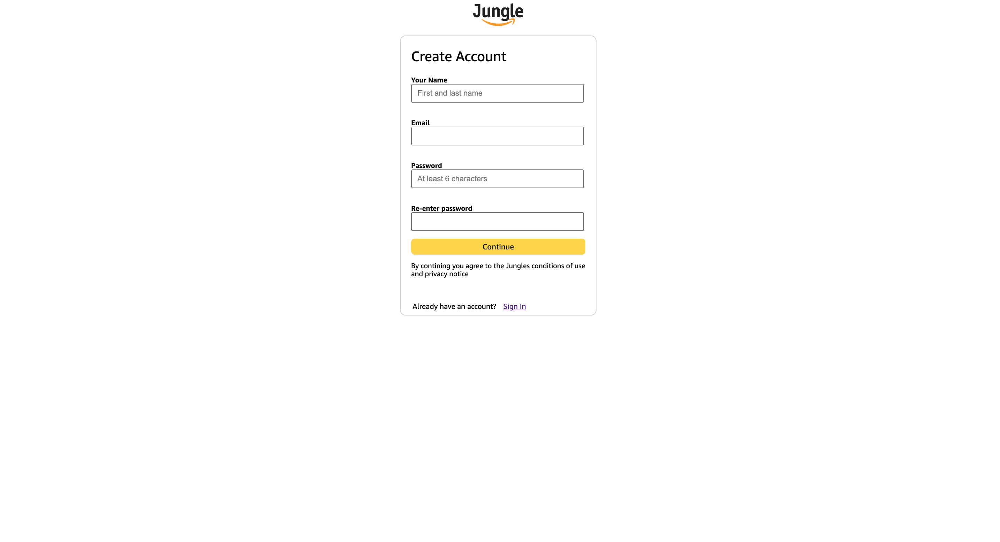
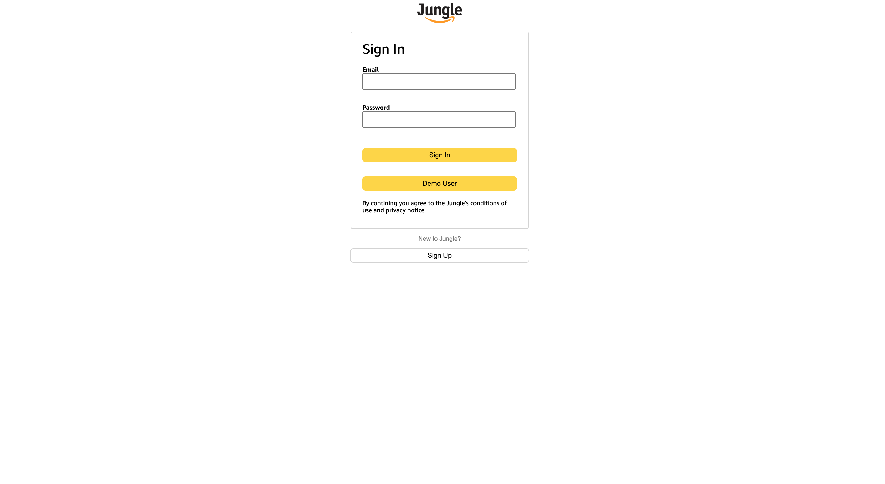

Jungle is an Amazon clone. The aim of the project is to implement Amazons key features and CRUD. These include browsing, having a cart with your choices and checking out. These key aspects serve to provide users with an easy to use shopping interface that encourages use of the site.





Functionality & MVPs
---------


In Jungle, users will be able to:

 Browse for different products throughout the site.
    


 View product information with images a description and pricing for the
 corresponding product.




 View thier cart with all their products and adjust the quantity or remove products.




 Create an account with a corresponding username and email.





Technologies, Libraries, APIs
-----------

The Backend - Utilizes Ruby on Rails to provide the logic for database processing to be displayed on the frontent.

The Frontend - Utilizes React, a Javascript library that implements certain functionalities to simplify frontent interface and scalability.

Redux - A tool for constant information storage, used to persist backend info for ease of navigation and component rendering.

AWS - Is an online storage server for maintaining large image files and hosting a variety of data, for utilization in scalable systems such as large websites or databases.


Feature Implementation:
---------

Products Show Page
-----

A product is located through the URL parameters that include the product ID. This is used through a useSelector to pull the current products slice of state and allow the page to render the information about the product. The useEffect serves to pull these products into the slice of state through the URL parameters as well.

``` js

    const ProductShow = () => {
    const dispatch = useDispatch();
    const productId = useParams().productId
    const product = useSelector(state => state.products?.[productId])
    const sessionUser = useSelector(state => state.session?.user)
    const userId = sessionUser?.id
    const history = useHistory();
    const priceStr = product?.productPrice?.toLocaleString()
    let price = priceStr?.split(".")
    price = price?.length < 2 ? [price[0], "00"] : price
    
    
    const handleAddToCart = (e) => {
        e.preventDefault();
        
        if (!sessionUser) {
            history.push('/login')
        } else {
            dispatch(cartActions.createCart({product_id: productId, user_id: userId, quantity: quantity}))
        }
        
    }
    
    useEffect(() => {
        dispatch(fetchProduct(productId))
    }, [productId]) 

}
```

Search Function 
-----

The useSelector will pull the backend search filter as a useState will actively change the incoming inputs from the user. A set timeout will limit the amout of fetches to the backend and effetivley serve to identify and values within a product to identify a users search query. 

``` js

function SearchBar() {
    const [searchText, setSearchText] = useState()
    const [timer, setTimer] = useState(0);
    const searchResults = useSelector(state => Object.values(state.search))
    const history = useHistory();
    const dispatch = useDispatch();

    function handleSearch(e) {
        const query = e.target.value

        setSearchText(query)
        clearTimeout(timer)

        if (query.trim() !== "") {
            setTimer(setTimeout(() => dispatch(fetchSearchResults(query)), 300));
        } else {
            dispatch(clearSearchResults);
            setSearchText("")
        }
    }


    function handClick(id) {

        return (e) => {
            e.preventDefault();
            history.push(`/products/${id}`)
            dispatch(clearSearchResults)
        }

    }

    function handleSubmit(e) {
        e.preventDefault();

        if (searchText.trim() !== '') {
            history.push(`/search?query=${searchText}`)
        }
    }


}

```

Cart Function 
-----

Products are fetched from the backend and are manipulated through the cart reducer depeding on user input, the cart verifies of a user is signed in before it allows interaction with the page. Active changes to the quantity are also sent to the backend and allows a user to purchase multiples which render on the page with current total price.

``` js

 useEffect(() => {
        dispatch(fetchProducts())
    }, [])
    
    if (!sessionUser) {
        history.push("/")
    }

    
    const itemIds = items.reduce((acc, cartItems) => {
        acc[cartItems.productId] = cartItems.id
        return acc;
        
    }, {});


    const handleChange = (cartItem) => {

        return (e) => {
            cartItem.quantity = e.target.value
            dispatch(cartActions.updateCart(cartItem))
        }

        
    }

    
    const handleDelete = (id) => {

        dispatch(cartActions.deleteCart(itemIds[id]))

    }


```

Future Implementations 
----

* Reviews, allow users to leave, delete and edit reviews
* Ratings, allow users to leave and edit ratings for specific products 
* Create preset filters for categories on the navigation bar for improved searching.


[Jungle-Link](jungle-2627.onrender.com/)


categories: 

Home

Electronics

Comfort 

Decor

Apparel